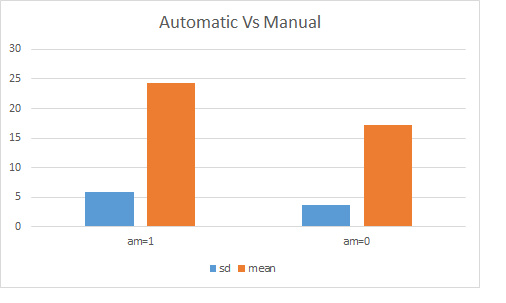

## `ggplot`

1. Using the `mpg`dataset in the `ggplot2` package, replicate the following plot.

```{r, echo=FALSE, warning=FALSE, message=FALSE}
library(tidyverse)
ggplot(mpg)+
  geom_histogram(aes(hwy, fill = drv),
                 alpha = 0.5)+
  facet_grid(drv ~ .)
```

2. Using the `midwest` dataset in the `ggplot2` package, replicate the following plot.

```{r, echo=FALSE, warning=FALSE, message=FALSE}
options(scipen = 999)
data(midwest)
midwest %>% 
  filter(poptotal >= 0 & poptotal <= 500000) %>% 
ggplot()+
  geom_point(aes(x = area,
                 y = poptotal,
                 col = state,
                 size = popdensity), 
             alpha = 0.5)
```

3. Using the `iris` dataset in the base R `datasets` package, replicate the following plot.

```{r, echo=FALSE, warning=FALSE, message=FALSE}
ggplot(iris)+
  geom_point(aes(x = Sepal.Length,
                 y = Sepal.Width,
                 shape = Species,
                 col = Species))
```

4. Using the `iris` dataset in the base R `datasets` package, replicate the following plot.

```{r, echo=FALSE, warning=FALSE, message=FALSE}
ggplot(iris)+
  geom_point(aes(x = Sepal.Length,
                 y = Sepal.Width,
                 shape = Species
                 ),
             col = "red")+
  facet_wrap(Species ~ .)
```

5. Using the `mpg` dataset in the `ggplot2` package, replicate the following plot.

```{r, echo=FALSE, warning=FALSE, message=FALSE}
na.omit(mpg) %>% 
ggplot(aes(manufacturer, displ))+
  geom_bar(aes(fill = class),
           stat = "identity")+
  coord_flip()
```

6. Using the `mpg` dataset in the `ggplot2` package, replicate the following plot.

```{r, echo=FALSE, warning=FALSE, message=FALSE}
ggplot(data = mpg) + 
  geom_point(mapping = aes(x = displ, y = hwy, shape = class))
```

7. Using the `mpg` dataset in the `ggplot2` package, replicate the following plot.

```{r, echo=FALSE, warning=FALSE, message=FALSE}
ggplot(data = mpg) + 
  geom_point(mapping = aes(x = displ, y = hwy)) + 
  facet_wrap(~ class, nrow = 2)
```

8. Using the `gapminder` data in the `gapminder` package, replicate the following plot.

```{r, echo=FALSE, warning=FALSE, message=FALSE}
library(gapminder); library(tidyverse)
gapminder %>% 
  filter(continent == "Asia") %>% 
ggplot()+ 
  geom_bar(aes(reorder(country, (pop/100000)), (pop/100000)), stat = "identity")+
  coord_flip()+
  labs(x = "Asian countries",
       y = "Population per 100000") 

  
```

9. Using the `starwars` data in the `dplyr` package, replicate the following plot.

```{r, echo=FALSE, warning=FALSE, message=FALSE}
library(ggrepel)
starwars %>%
  ggplot(aes(height, mass))+
  geom_point()+
  geom_label_repel(aes(label = if_else(mass > 500& height >150, as.character(species), "")),
            nudge_x = 10)+
  geom_point(aes(x = filter(starwars, height > 150 & mass > 500)$height,
                 y = filter(starwars, height > 150 & mass > 500)$mass
                 ),
             col = "red"
             )+
  geom_label_repel(aes(label = if_else(mass < 100& height < 70, as.character(species), "")),
            nudge_y = 140, nudge_x = 20)+
  geom_point(aes(x = filter(starwars,mass < 100& height < 70)$height,
                 y = filter(starwars, mass < 100& height < 70)$mass
                 ),
             col = "blue"
             )
  
  
```


## `dplyr`
1. Which species have blue eyes in the `starwars` dataset in the `dplyr` package?
```{r, echo=FALSE, eval=FALSE}
starwars %>% 
  filter( eye_color == "blue") %>% 
  group_by(species) %>% 
  count()
```

2. How many female humans are there in the `starwars` dataset in the `dplyr` package ?
```{r, echo=FALSE, eval=FALSE}
starwars %>% 
  filter(species == "Human" & sex == "female") %>% 
  select(species, sex) %>% 
  count()
```

3. In the `starwars` dataset in the `dplyr` package, which species has the most number of blue eye colour?
```{r, echo=FALSE, eval=FALSE}
starwars %>% 
  filter(eye_color== "blue") %>% 
  group_by(species) %>% 
  count()
```

4. In the `starwars` dataset in the `dplyr` package, what is the average mass of female Human species ?
```{r, echo=FALSE, eval=FALSE}
starwars %>% 
  filter(species == "Human" & sex == "female") %>% 
  summarise(mean_mass = mean(na.omit(mass)))
```

5. In the `starwars` dataset in the `dplyr` package, how many species have a fair skin colour?
```{r, echo=FALSE, eval=FALSE}
starwars %>% 
  filter(skin_color == "fair") %>% 
  select(species, skin_color)
```

6. Calculate the mean *mpg* (miles per gallon) of the  cars with 6 and 4 cylinders in `mtcars` dataset in the base R `datasets` package.
```{r, echo=FALSE, eval=FALSE}
mtcars %>% 
  select(mpg,cyl) %>% 
  filter(cyl %in% c(6,4)) %>%
  group_by(cyl) %>% 
  summarise(mean(mpg))
```

7. Which type of transmission (manual or automatic) has a higher variation (standard deviation) of *mpg* in the `mtcars` dataset in the base R `datasets` package?

```{r, echo=FALSE, eval=FALSE}
mtcars %>% 
  select(mpg, am) %>% 
  group_by(am) %>% 
  summarise(sd(mpg))
  
```

8. What is the average displacement of a manual car with 4 cylinders in the `mtcars` dataset in the base R `datasets` package?
```{r, echo=FALSE, eval=FALSE}
mtcars %>% 
  filter(cyl == 4 & am == 1) %>% 
  summarise(mean(disp))
```

9. Which specie has the longest and widest petal in the `iris` dataset in the base R `datasets` packages?
```{r, echo=FALSE, eval=FALSE}
iris %>% 
  group_by(Species) %>% 
  summarise(max(Petal.Length), max(Petal.Width))
```

## `tidyr`

1. Tidy and replicate the `construction` dataset in the `tidyr` package as given below. 

```{r, echo=FALSE}
construction %>% 
  pivot_longer(cols = Northeast:West, 
               names_to = "Region",
               values_to = "Completed_Units_Region") %>% 
  pivot_longer(cols = `1 unit`: `5 units or more`,
               names_to = "Size",
               values_to = "Completed_Units_Size")
```

2. Tidy and replicate the `fish_encounters` dataset in the `tidyr` package as given below.

```{r, echo=FALSE}
fish_encounters %>% 
  pivot_wider(names_from = station,
              values_from = seen) %>% 
  na.omit()  
```

3. Tidy and replicate the `who` dataset in the `tidyr` package as given below.
```{r, echo=FALSE}
who %>% 
  pivot_longer(cols = new_sp_m014:newrel_f65,
               names_to = "Diagnosis",
               values_to = "Value") %>% 
  filter(country == "India" & year == 2002) %>% 
  arrange(desc(Value))
```

4. Tidy and replicate the `world_bank_pop` dataset in the `tidyr` package as given below.

```{r, echo=FALSE}
world_bank_pop %>% 
  pivot_longer(cols = `2000`: `2017`,
               names_to = "Year",
               values_to = "Population") %>% 
  filter(country == "IND" & Year == 2000) %>% 
  arrange(Population)
```

5. Tidy and replicate the `population` dataset in the `tidyr` package as given below.

```{r, echo=FALSE}
population %>% 
  pivot_wider(names_from = year,
              values_from = population) %>% 
  filter(country %in% c("India", "China")) %>% 
  arrange(desc(country))
```

6. Tidy and replicate the `us_rent_income` dataset in the `tidyr` package as given below.

```{r, echo=FALSE}
us_rent_income %>% 
  pivot_wider(names_from = variable,
              values_from = estimate) %>% 
  filter(moe <= 3) %>% 
  arrange(rent)

```

7. Tidy and replicate the `relig_income` dataset in the `tidyr` package as given below.

```{r, echo=FALSE}
relig_income %>% 
  pivot_longer(cols = 2:11,
               names_to = "Income",
               values_to = "Count") %>% 
  filter(Income == "<$10k") %>% 
  arrange(Count)

```

8. Tidy and replicate the `billboard` dataset in the `tidyr` package as given below.

```{r, echo=FALSE}
billboard %>% 
  separate(col = date.entered,
           into = c("year", "month", "day"),
           convert = TRUE) %>% 
  filter(month == 1, year == 2000, day == 1)
```

9. Tidy and replicate the `airlines` dataset in the `nycflights13` package as given below.

```{r, echo=FALSE, warning=FALSE, message=FALSE}
library(nycflights13)
airlines %>% 
  separate(col = name,
           into = c("airline", "name1", "name2" ), sep = " ") %>% 
  select(carrier, airline)
```


## base R

1. Run the following codes and explain why the value of `address1` is shown as `NA` while the `class(address1)` is `numeric`?
```{r, eval=FALSE}
x1 <- "Presidency"
x2 <- "University"
x3 <- "Kolkata"
address <- c(x1, x2, x3)
address1 <- as.numeric(address)
address1
class(address1)
```

2. Explain the following codes and their outputs.
```{r, eval=FALSE}
a1 <- 12; class(a1); length(a1)
names(a1) <- 'Number'; names(a1)
```

3. Explain the following codes and their outputs.
```{r, eval=FALSE}
a2 <- matrix(1:9, nrow = 3)
colnames(a2) <- c("A", "B", "C")

a2[c(TRUE, FALSE, TRUE), c("B", "A")]
```

4. Explain the following codes and their outputs.
```{r, eval=FALSE}
month_levels <- c(
  "Jan", "Feb", "Mar", "Apr", "May", "Jun", 
  "Jul", "Aug", "Sep", "Oct", "Nov", "Dec"
)
a4 <- factor(c("Dec", "Apr", "Jan", "Mar"), levels = month_levels)
a4
```

5. Explain the following codes and their outputs.
```{r, eval=FALSE}
a5 <- factor(c("high", "low", "medium", "medium", "high"), levels = c("low", "medium", "high"), ordered = TRUE)
a5
```

6. Explain the following codes and their outputs.
```{r, eval=FALSE}
library(gapminder)
filter(gapminder, continent %in% c("Asia", "Africa"))
```

7. In the `geom_bar()` function explain the difference between the use of `stat = "identity"` and `stat = "count"`.

8. Explain the following codes and their outputs.
```{r, eval=FALSE}
s <- 1:5
rating <- factor(s)

(rating <- factor(s, ordered = TRUE,
                levels = s))
```

9. Write a code to print the following output.
```{r, message=FALSE, warning=FALSE, echo=FALSE}
library(tidyverse)
tibble(`@gmail.com` = c("presi", "econ"),
           `:)` = c(0,1))
```


https://bookdown.org/sunboklee/ewha_r_2021_1/base-r-quiz.html#quiz-problem-1

## Excel

1. Which specie has the longest and the widest petal in the `iris.xlsx` data?
2. What is the average displacement of a manual car with 4 cylinders in the `mtcars.xlsx` dataset?
3. Calculate the mean *mpg* (miles per gallon) of the  cars with 6 and 4 cylinders in `mtcars.xlsx` dataset?
4. How many years of data are available for each country in the `GDP.xlsx` dataset? How many countries do not have data for all the years?
5. In the file `GDP.xlsx` how many countries do not have data on GDP?
6. Rank (without ties) the countries according to the Gross Domestic Product (GDP) in the `GDP.xlsx` dataset.
7. How does the number of cylinders `cyl` affect the mileage `mpg` for a given horsepower `hp`? Calculate the partial correlation in the `mtcars.xlsx` dataset.
8. How many missing values are there in total in the `GDP.xlsx` dataset? Find how many countries are listed in the data without using the filter option?

## plots
9. Using the data `GDP.xlsx`, for any two countries plot separate line charts for the components of GDP (Household Consumption Expenditure, Government final consumption expenditure, Net exports and Gross Capital formation).
10. Using the `GDP.xlsx` data replicate the following plot.

11. Using the `GDP.xlsx` data replicate the following plot.

12. Using the `mtcars.xlsx` dataset replicate the followuing plot.

13. Suppose that the firm’s production function is $Q=F(K,L)=50K^{0.5}L^{0.5}$. Suppose, too, that the price of labour w=5 and the price of capital r=20. What is the cost minimising input bundle if the firm wants to produce 1,000 units per year?


