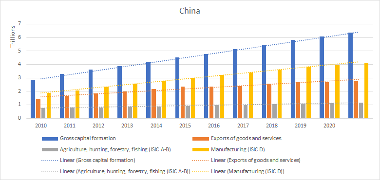

\begin{center}
{\Large ECON03SEC1}\\
{\Large Department of Economics}\\
{\Large Presidency University, Kolkata}\\
{\large Full Marks: 40}\\
{\large 21/01/2022}
\end{center}


\begin{center}
\textbf{Group 1 (R)}
\end{center}

Answer all of the following questions. [4 $\times$ 5 = 20]


1. Using the `mpg` dataset in the `ggplot2` package, replicate the following plot.

```{r, echo=FALSE, warning=FALSE, message=FALSE}
library(tidyverse)
ggplot(data = mpg) + 
  geom_point(mapping = aes(x = displ, y = hwy)) + 
  facet_wrap(~ class, nrow = 2)
```


2. Which type of transmission (manual or automatic) has a higher variation (standard deviation) of *mpg* in the `mtcars` dataset in the base R `datasets` package?

```{r, echo=FALSE, eval=FALSE}
mtcars %>% 
  select(mpg, am) %>% 
  group_by(am) %>% 
  summarise(sd(mpg))
  
```


3. Tidy and replicate the `relig_income` dataset in the `tidyr` package as given below.

```{r, echo=FALSE}
relig_income %>% 
  pivot_longer(cols = 2:11,
               names_to = "Income",
               values_to = "Count") %>% 
  filter(Income == "<$10k") %>% 
  arrange(Count)

```


4. In the `geom_bar()` function explain the difference between the use of `stat = "identity"` and `stat = "count"`.


\begin{center}
\textbf{Group 2 (Excel)}
\end{center}

Answer all of the following questions. [4 $\times$ 5 = 20]

1. Using the `GDP.xlsx` data replicate the following plot.



2. Calculate the mean *mpg* (miles per gallon) of the  cars with 6 and 4 cylinders in `mtcars.xlsx` dataset?
3. How many missing values are there in total in the `GDP.xlsx` dataset? Find how many countries are listed in the data without using the filter option?
4. Suppose that the firm’s production function is $Q=F(K,L)=50K^{0.5}L^{0.5}$. Suppose, too, that the price of labour w=5 and the price of capital r=20. What is the cost minimising input bundle if the firm wants to produce 1,000 units per year?

