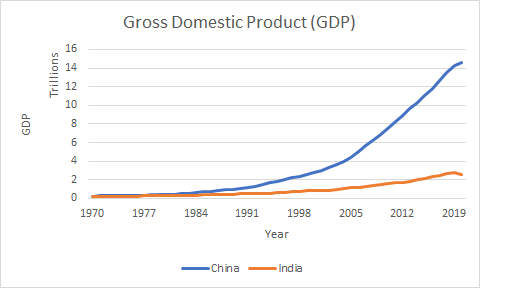

\begin{center}
{\Large ECON03SEC1}\\
{\Large Department of Economics}\\
{\Large Presidency University, Kolkata}\\
{\large Full Marks: 40}\\
{\large 21/01/2022}
\end{center}


\begin{center}
\textbf{Group 1 (R)}
\end{center}

Answer all of the following questions. [4 $\times$ 5 = 20]


1. Using the `starwars` data in the `dplyr` package, replicate the following plot.

```{r, echo=FALSE, warning=FALSE, message=FALSE}
library(ggrepel); library(tidyverse)
starwars %>%
  ggplot(aes(height, mass))+
  geom_point()+
  geom_label_repel(aes(label = if_else(mass > 500& height >150, as.character(species), "")),
            nudge_x = 10)+
  geom_point(aes(x = filter(starwars, height > 150 & mass > 500)$height,
                 y = filter(starwars, height > 150 & mass > 500)$mass
                 ),
             col = "red"
             )+
  geom_label_repel(aes(label = if_else(mass < 100& height < 70, as.character(species), "")),
            nudge_y = 140, nudge_x = 20)+
  geom_point(aes(x = filter(starwars,mass < 100& height < 70)$height,
                 y = filter(starwars, mass < 100& height < 70)$mass
                 ),
             col = "blue"
             )
  
  
```


2. Which specie has the longest and widest petal in the `iris` dataset in the base R `datasets` packages?
```{r, echo=FALSE, eval=FALSE}
iris %>% 
  group_by(Species) %>% 
  summarise(max(Petal.Length), max(Petal.Width))
```


3. Tidy and replicate the `airlines` dataset in the `nycflights13` package as given below.

```{r, echo=FALSE, warning=FALSE, message=FALSE}
library(nycflights13)
airlines %>% 
  separate(col = name,
           into = c("airline", "name1", "name2" ), sep = " ") %>% 
  select(carrier, airline)
```


4. Write a code to print the following output.
```{r, message=FALSE, warning=FALSE, echo=FALSE}
library(tidyverse)
tibble(`@gmail.com` = c("presi", "econ"),
           `:)` = c(0,1))
```


\begin{center}
\textbf{Group 2 (Excel)}
\end{center}

Answer all of the following questions. [4 $\times$ 5 = 20]


10. Using the `GDP.xlsx` data replicate the following plot.



2. What is the average displacement of a manual car with 4 cylinders in the `mtcars.xlsx` dataset?
6. Rank (without ties) the countries according to the Gross Domestic Product (GDP) in the `GDP.xlsx` dataset.
13. Suppose that the firm’s production function is $Q=F(K,L)=50K^{0.5}L^{0.5}$. Suppose, too, that the price of labour w=5 and the price of capital r=20. What is the cost minimising input bundle if the firm wants to produce 1,000 units per year?

